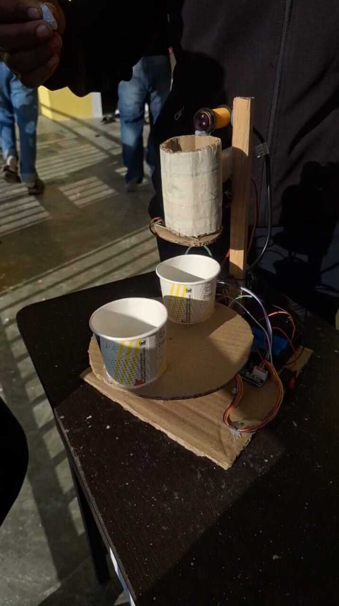

# Smart Waste Segregation System

This repository contains the code and documentation for a smart waste segregation system that automatically separates dry and wet waste using sensors and motors.

## Overview

The system automates waste segregation using an optical sensor to detect objects, a raindrop sensor to measure moisture, and motors to sort waste into the correct bins.

## Workflow

1. **Object Detection**: The optical sensor detects when waste is placed for sorting.
2. **Moisture Detection**: The raindrop sensor measures moisture by detecting resistance changes, classifying waste as dry or wet.
3. **Sorting Mechanism**:
	- The stepper motor positions the bucket for dry or wet waste.
	- The servo motor opens the chute to drop the waste into the correct bucket.

## Hardware Components

- Optical sensor (object detection)
- Raindrop sensor (moisture detection)
- Stepper motor (bucket positioning)
- Servo motor (chute opening)
- Microcontroller (e.g., Arduino)

## Code Structure

- `object_detect/`: Optical sensor code
- `rain_drop_read/`: Raindrop sensor code
- `segregrate/`: Main segregation logic and motor control
- `servo_test/`: Servo motor test code
- `stepper_test/`: Stepper motor test code
- `ir_test/`: IR sensor test code

## How It Works

1. Place waste in the input area.
2. Optical sensor triggers detection.
3. Raindrop sensor checks moisture to classify as dry or wet.
4. Stepper motor rotates the bucket to the correct position.
5. Servo motor opens the chute to drop the waste.

## Getting Started

1. Connect all sensors and motors as per your circuit diagram.
2. Upload the `.ino` files to your microcontroller.
3. Power on and test each module using the provided test codes.

## System Image

## License

This project is open source and available under the MIT License.
